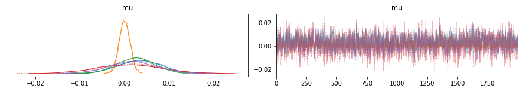
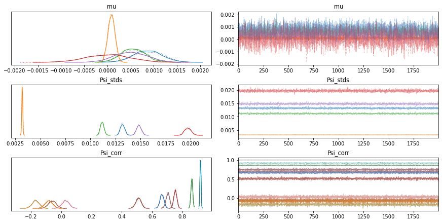
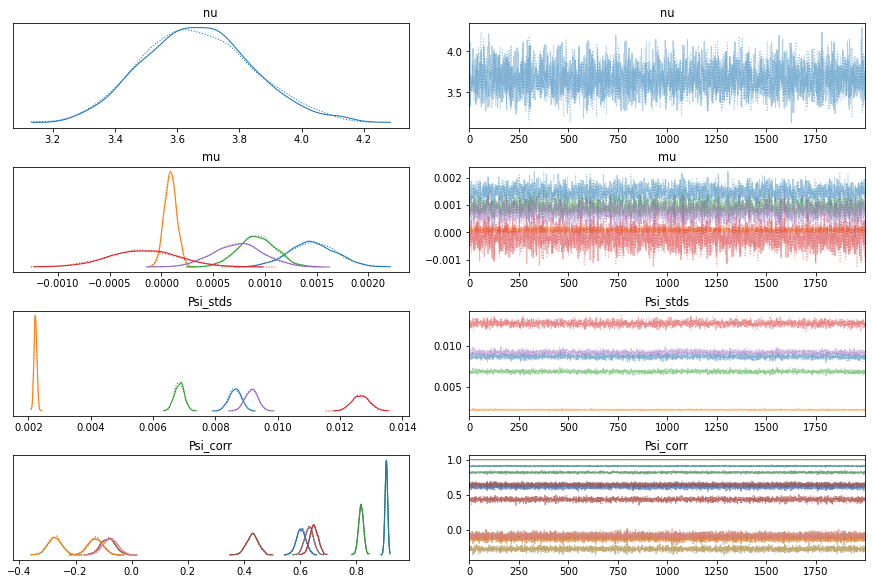

The Black-Litterman (B-L) model is perhaps one of the most well-known models in finance. It has both mean-variance optimization and Bayesian inference as building blocks. 

The Black-Litterman model is a combination of both ideas: it relies on return data in order to find optimal portfolio allocations, however it allows for the incorporation of investors' opinions about future returns. This is done in a Bayesian setting via prior distributions.

The B-L formula for estimated mean returns is

$\hat{\mu}_{BL} = [(\tau \Sigma)^{-1} + P' \Omega^{-1} P]^{-1} [(\tau \Sigma)^{-1} \Pi + P' \Omega^{-1} Q]$

Now let's break it down. First of all, the B-L model does not use the historical (sample) mean returns as the prior estimate of mean returns, as it tends to produce extreme long and short positions in unconstrained settings. Instead, it relies on implied market equilibrium returns, $\Pi$, as the prior estimate for mean returns. The formula for $\Pi$ consists of

$\Pi = \lambda \Sigma w_{mkt}$

Starting with the more simple parameters, $\Sigma$ is the sample covariance matrix and $w_{mkt}$ is the market capitalization weight of all assets. $\lambda$ is the market price of risk, calculated by dividing the excess market returns by its variance:

$\lambda = \frac{r_m - r_f}{\sigma^2}$

With all three components, we can obtain the values for $\Pi$, an $N \times 1$ vector where $N$ is our number of assets


```python
import yfinance as yf
import numpy as np
import pandas as pd
import matplotlib.pyplot as plt
%matplotlib inline

data = yf.download("QQQ SCHP SPY XLE XLF", start="2015-01-01", end="2022-01-01")["Close"]
risk_free = yf.download("^IRX", start="2015-01-01", end="2022-01-01")["Close"]
```

    [*********************100%***********************]  5 of 5 completed
    [*********************100%***********************]  1 of 1 completed


```python
tickers = ["QQQ", "SCHP", "SPY", "XLE", "XLF"]
assets_volume = np.empty(len(tickers))
for i in range(0,len(tickers)):
    assets_volume[i] = yf.Ticker(tickers[i]).info["totalAssets"]
assets_volume
```


    array([1.96473848e+11, 2.02069627e+10, 4.16984859e+11, 3.69832387e+10,
           4.61583442e+10])


```python
w_mkt = assets_volume/np.sum(assets_volume)
w_mkt
```


    array([0.27409579, 0.02819023, 0.58172522, 0.0515944 , 0.06439436])


```python
data.head()
```


<div>
<style scoped>
    .dataframe tbody tr th:only-of-type {
        vertical-align: middle;
    }

    .dataframe tbody tr th {
        vertical-align: top;
    }

    .dataframe thead th {
        text-align: right;
    }
</style>
<table border="1" class="dataframe">
  <thead>
    <tr style="text-align: right;">
      <th></th>
      <th>QQQ</th>
      <th>SCHP</th>
      <th>SPY</th>
      <th>XLE</th>
      <th>XLF</th>
    </tr>
    <tr>
      <th>Date</th>
      <th></th>
      <th></th>
      <th></th>
      <th></th>
      <th></th>
    </tr>
  </thead>
  <tbody>
    <tr>
      <th>2015-01-02</th>
      <td>102.940002</td>
      <td>54.509998</td>
      <td>205.429993</td>
      <td>79.529999</td>
      <td>20.089357</td>
    </tr>
    <tr>
      <th>2015-01-05</th>
      <td>101.430000</td>
      <td>54.560001</td>
      <td>201.720001</td>
      <td>76.239998</td>
      <td>19.666937</td>
    </tr>
    <tr>
      <th>2015-01-06</th>
      <td>100.070000</td>
      <td>54.599998</td>
      <td>199.820007</td>
      <td>75.120003</td>
      <td>19.366369</td>
    </tr>
    <tr>
      <th>2015-01-07</th>
      <td>101.360001</td>
      <td>54.599998</td>
      <td>202.309998</td>
      <td>75.279999</td>
      <td>19.569456</td>
    </tr>
    <tr>
      <th>2015-01-08</th>
      <td>103.300003</td>
      <td>54.580002</td>
      <td>205.899994</td>
      <td>76.970001</td>
      <td>19.861900</td>
    </tr>
  </tbody>
</table>
</div>


```python
market_mean_returns = data.pct_change().dropna().mean().values * 252
market_var_returns = data.pct_change().dropna().var().values * 252
mean_risk_free = np.mean(risk_free)/100

lamb = (market_mean_returns - mean_risk_free)/market_var_returns
lamb
```


    array([ 4.71279935,  5.37396438,  4.04961583, -0.10082263,  2.06742197])


```python
Sigma = (data.pct_change().dropna().cov() * 252).values
Sigma
```


    array([[ 0.04403909, -0.00064208,  0.03429687,  0.03372609,  0.03301414],
           [-0.00064208,  0.00255606, -0.00076072,  0.00042066, -0.00202911],
           [ 0.03429687, -0.00076072,  0.03154995,  0.03929114,  0.03616083],
           [ 0.03372609,  0.00042066,  0.03929114,  0.09824498,  0.05579175],
           [ 0.03301414, -0.00202911,  0.03616083,  0.05579175,  0.05562646]])


```python
Pi = lamb * (Sigma @ w_mkt)
Pi
```


    array([ 0.16904897, -0.00352222,  0.12994544, -0.00411097,  0.07543624])


Now, with our prior estimates for the mean returns in hand, we can begin to incorporate the subjective views onto the Black-Litterman model. This is the purpose of matrices $Q$ and $P$.

Suppose we have the following subjective views:
* QQQ will rise 10%
* SPY will drop 5%
* XLE will outperform XLF by 8%

The first two are *absolute* views, and the last one is a *relative* view.

$Q$ is the $K \times 1$ matrix that contains these views, where $K$ is the number of views


```python
Q = np.array([0.1,-0.05,0.08])
Q
```


    array([ 0.1 , -0.05,  0.08])


$P$ is the picking matrix, which will map the views onto the assets. It has dimensions $K \times N$.

For absolute views, the rows have $1$ for the corresponding asset and $0$ for all others. For relative views, it has positive numbers for the outperforming assets and negative numbers for the underperforming assets, with all numbers together adding up to zero.


```python
P = np.array([[1,0,0,0,0],[0,0,1,0,0],[0,0,0,1,-1]])
P
```


    array([[ 1,  0,  0,  0,  0],
           [ 0,  0,  1,  0,  0],
           [ 0,  0,  0,  1, -1]])


The last components of the Black-Litterman formula are the matrix $\Omega$ and the quantity $\tau$.

$\Omega$ is referred to as the confidence matrix, as it represents the uncertainty we have in our views. It is the covariance matrix of our views, meaning that our views are actually of the form $Q + \boldsymbol{\varepsilon}$, where $\boldsymbol{\varepsilon} \sim MVN(\boldsymbol{0}, \Omega)$

$\Omega$ is a diagonal matrix, as the views have zero correlation, i.e., are independent of each other. As it is quite difficult to summarise the uncertainty contained in each view, many methods for its calculation have been proposed. We shall stick to Idzorek's method, which allows for users to specify their confidence in each view as a percentage.

The original method by Idzorek estimates the view variances, $\omega_i$, via least squares. Walters (2014) proposes a closed-form method.

Denoting by $conf$ the confidence in each of our views, which can range from zero to 100%, we shall have

$\alpha = \frac{1-conf}{conf}$

$\Omega = \tau \alpha P \Sigma P'$

This leaves us with $\tau$. From the B-L formula we can see it is inversely proportional to the weight given to our prior estimate for the mean returns, $\Pi$. As $\Pi$ corresponds to market equilibrium returns, Idzorek cites that, since the uncertainty in the mean is reasonably lower than the uncertainty in the observed historical returns, $\tau$ should be close to zero. For the sake of simplicity, we set $\tau = 0.05$ for our example.

Assuming a confidence of 40%, we have


```python
conf = np.array([0.7, 0.6, 0.4])
tau = 0.05

alpha = (1-conf)/conf

Omega_diag = tau * (alpha @ (P @ Sigma @ P.T))
Omega = np.diag(Omega_diag)
Omega
```


    array([[0.00214032, 0.        , 0.        ],
           [0.        , 0.00202137, 0.        ],
           [0.        , 0.        , 0.00329119]])


Now we can go back to the B-L formula and obtain the Black-Litterman posterior estimates for mean returns

$\hat{\mu}_{BL} = [(\tau \Sigma)^{-1} + P' \Omega^{-1} P]^{-1} [(\tau \Sigma)^{-1} \Pi + P' \Omega^{-1} Q]$


```python
mu_bl = np.linalg.inv(np.linalg.inv(tau*Sigma) + (P.T @ np.linalg.inv(Omega) @ P)) @ ((np.linalg.inv(tau*Sigma) @ Pi) + (P.T @ np.linalg.inv(Omega) @ Q))
mu_bl
```


    array([ 0.08912944,  0.00216181,  0.05869021, -0.03529702, -0.01314272])


Compare with the historical mean returns


```python
data.pct_change().dropna().mean().values * 252
```


    array([ 0.21554025,  0.02172902,  0.13575803, -0.00191245,  0.12299622])


The first part of the B-L formula for the mean returns, $[(\tau \Sigma)^{-1} + P' \Omega^{-1} P]^{-1}$, is actually the B-L posterior estimate of the returns covariance matrix.


```python
cov_bl = np.linalg.inv(np.linalg.inv(tau*Sigma) + (P.T @ np.linalg.inv(Omega) @ P))
cov_bl.round(4)
```


    array([[ 0.0008, -0.    ,  0.0006,  0.0005,  0.0005],
           [-0.    ,  0.0001, -0.    , -0.    , -0.0001],
           [ 0.0006, -0.    ,  0.0006,  0.0009,  0.0008],
           [ 0.0005, -0.    ,  0.0009,  0.0029,  0.0017],
           [ 0.0005, -0.0001,  0.0008,  0.0017,  0.0017]])


In order to find the allocation weights for the B-L model, we can just plug the posterior mean and covariance estimates into the regular mean-variance optimizer, or find the weights via reverse optimization

$w_{BL} = (\lambda \Sigma)^{-1} \hat{\mu}_{BL}$

We can also normalize so that all weights add up to 1


```python
w_bl = np.linalg.inv(lamb * Sigma) @ mu_bl
w_bl = w_bl/np.sum(w_bl)
w_bl
```


    array([-0.05935261, -0.00429207,  0.2537835 ,  1.01106849, -0.20120731])


The library PyPortfolioOpt contains straightforward implementations of the Black-Litterman procedures we have seen up to here


```python
from pypfopt import black_litterman, risk_models

lamb = black_litterman.market_implied_risk_aversion(data, risk_free_rate=mean_risk_free)
Pi = black_litterman.market_implied_prior_returns(assets_volume, lamb, Sigma, risk_free_rate=mean_risk_free) - mean_risk_free
```

    /home/thomas/anaconda3/lib/python3.8/site-packages/pypfopt/black_litterman.py:42: RuntimeWarning: If cov_matrix is not a dataframe, market cap index must be aligned to cov_matrix
      warnings.warn(


```python
lamb
```


    QQQ     4.712799
    SCHP    5.373964
    SPY     4.049616
    XLE    -0.100823
    XLF     2.067422
    dtype: float64


```python
Pi
```


    QQQ     0.169049
    SCHP   -0.003522
    SPY     0.129945
    XLE    -0.004111
    XLF     0.075436
    dtype: float64


```python
from pypfopt.black_litterman import BlackLittermanModel

cov_matrix = (data.pct_change().dropna().cov() * 252)
bl = BlackLittermanModel(cov_matrix, pi=Pi, Q=Q, P=P, omega=Omega, view_confidences=conf, tau=0.05, risk_free_rate=mean_risk_free)

mu_bl = bl.bl_returns()
mu_bl
```


    QQQ     0.089129
    SCHP    0.002162
    SPY     0.058690
    XLE    -0.035297
    XLF    -0.013143
    dtype: float64


Now let's go back to the B-L formula:

$\hat{\mu}_{BL} = [(\tau \Sigma)^{-1} + P' \Omega^{-1} P]^{-1} [(\tau \Sigma)^{-1} \Pi + P' \Omega^{-1} Q]$

The reason we can obtain a closed-form expression for $\hat{\mu}_{BL}$ is because the Black-Litterman model makes use of conjugate priors.

The parameter we wish to make inference for is the vector of asset mean returns, or expected returns. 

Our prior distribution for the mean returns is a multivariate normal. The mean vector of that prior distribution is $\Pi$, which comes from market equilibrium, is calculated from the data. The prior covariance is $\tau \Sigma$, and $\Sigma$ is the sample covariance, also calculated from market return data.

The subjective investor views, which are the B-L "likelihood", also follow a multivariate normal distribution.

Bayesian conjugate analysis shows us that, a mean vector $\boldsymbol{\mu}$ of a multivariate normal distribution with covariance $\boldsymbol{\Sigma}$, with prior distribution

$\boldsymbol{\mu} \sim MVN(\boldsymbol{\mu}_0, \boldsymbol{\Sigma}_0)$

shall have the posterior covariance

$\boldsymbol{\Sigma}_P = [\boldsymbol{\Sigma}_0^{-1} + n \boldsymbol{\Sigma}^{-1}]^{-1}$

and posterior mean

$\boldsymbol{\mu}_P = \boldsymbol{\Sigma}_P [\boldsymbol{\Sigma}_0^{-1} \boldsymbol{\mu}_0 + n \boldsymbol{\Sigma}^{-1} \mathbf{\bar{x}}]$, 

where $\mathbf{\bar{x}}$ is the sample mean. 

These expressions are similar to the B-L formula.

But what if we wanted to depart from the conjugate priors in the B-L framework?

MCMC allows us to do that. Schepel (2019) presents us with a few extensions of the B-L model, some making use of MCMC algorithms. Let's assume the first model to be estimated by MCMC is similar to the classical B-L model:

$\mu \sim N(\Pi, \tau \Sigma)$

$Q|\mu \sim N(P\mu, \Omega)$

$r \sim N(\mu, \Sigma)$


```python
import pymc3 as pm

with pm.Model() as model_normal:
    mu = pm.MvNormal('mu', mu = Pi.values, cov = (tau * Sigma), shape = 5)
    Q_p = pm.MvNormal('Q', mu = pm.math.dot(P, mu), cov = Omega, observed = Q, shape = 3)
    r = pm.MvNormal('returns', mu = mu, cov = Sigma, observed = data.pct_change().dropna().values)

    trace_normal = pm.sample(2000, tune=1000, target_accept=0.8, init='adapt_diag')
```

    /home/thomas/anaconda3/lib/python3.8/site-packages/pymc3/sampling.py:465: FutureWarning: In an upcoming release, pm.sample will return an `arviz.InferenceData` object instead of a `MultiTrace` by default. You can pass return_inferencedata=True or return_inferencedata=False to be safe and silence this warning.
      warnings.warn(
    Auto-assigning NUTS sampler...
    Initializing NUTS using adapt_diag...
    Multiprocess sampling (2 chains in 2 jobs)
    NUTS: [mu]


<div>
    <style>
        /* Turns off some styling */
        progress {
            /* gets rid of default border in Firefox and Opera. */
            border: none;
            /* Needs to be in here for Safari polyfill so background images work as expected. */
            background-size: auto;
        }
        .progress-bar-interrupted, .progress-bar-interrupted::-webkit-progress-bar {
            background: #F44336;
        }
    </style>
  <progress value='6000' class='' max='6000' style='width:300px; height:20px; vertical-align: middle;'></progress>
  100.00% [6000/6000 00:48<00:00 Sampling 2 chains, 0 divergences]
</div>


    Sampling 2 chains for 1_000 tune and 2_000 draw iterations (2_000 + 4_000 draws total) took 49 seconds.
    The number of effective samples is smaller than 25% for some parameters.


```python
import arviz as az

az.summary(trace_normal)
```

    /home/thomas/anaconda3/lib/python3.8/site-packages/arviz/data/io_pymc3.py:88: FutureWarning: Using `from_pymc3` without the model will be deprecated in a future release. Not using the model will return less accurate and less useful results. Make sure you use the model argument or call from_pymc3 within a model context.
      warnings.warn(


<div>
<style scoped>
    .dataframe tbody tr th:only-of-type {
        vertical-align: middle;
    }

    .dataframe tbody tr th {
        vertical-align: top;
    }

    .dataframe thead th {
        text-align: right;
    }
</style>
<table border="1" class="dataframe">
  <thead>
    <tr style="text-align: right;">
      <th></th>
      <th>mean</th>
      <th>sd</th>
      <th>hdi_3%</th>
      <th>hdi_97%</th>
      <th>mcse_mean</th>
      <th>mcse_sd</th>
      <th>ess_mean</th>
      <th>ess_sd</th>
      <th>ess_bulk</th>
      <th>ess_tail</th>
      <th>r_hat</th>
    </tr>
  </thead>
  <tbody>
    <tr>
      <th>mu[0]</th>
      <td>0.004</td>
      <td>0.005</td>
      <td>-0.006</td>
      <td>0.013</td>
      <td>0.0</td>
      <td>0.0</td>
      <td>1152.0</td>
      <td>1152.0</td>
      <td>1149.0</td>
      <td>1859.0</td>
      <td>1.0</td>
    </tr>
    <tr>
      <th>mu[1]</th>
      <td>0.000</td>
      <td>0.001</td>
      <td>-0.002</td>
      <td>0.002</td>
      <td>0.0</td>
      <td>0.0</td>
      <td>2280.0</td>
      <td>1501.0</td>
      <td>2282.0</td>
      <td>2124.0</td>
      <td>1.0</td>
    </tr>
    <tr>
      <th>mu[2]</th>
      <td>0.003</td>
      <td>0.004</td>
      <td>-0.005</td>
      <td>0.010</td>
      <td>0.0</td>
      <td>0.0</td>
      <td>999.0</td>
      <td>943.0</td>
      <td>995.0</td>
      <td>1257.0</td>
      <td>1.0</td>
    </tr>
    <tr>
      <th>mu[3]</th>
      <td>0.001</td>
      <td>0.007</td>
      <td>-0.012</td>
      <td>0.014</td>
      <td>0.0</td>
      <td>0.0</td>
      <td>1154.0</td>
      <td>1154.0</td>
      <td>1154.0</td>
      <td>1556.0</td>
      <td>1.0</td>
    </tr>
    <tr>
      <th>mu[4]</th>
      <td>0.002</td>
      <td>0.005</td>
      <td>-0.009</td>
      <td>0.011</td>
      <td>0.0</td>
      <td>0.0</td>
      <td>1151.0</td>
      <td>1151.0</td>
      <td>1149.0</td>
      <td>1667.0</td>
      <td>1.0</td>
    </tr>
  </tbody>
</table>
</div>


```python
az.plot_trace(trace_normal)
```

    /home/thomas/anaconda3/lib/python3.8/site-packages/arviz/data/io_pymc3.py:88: FutureWarning: Using `from_pymc3` without the model will be deprecated in a future release. Not using the model will return less accurate and less useful results. Make sure you use the model argument or call from_pymc3 within a model context.
      warnings.warn(


    array([[<AxesSubplot:title={'center':'mu'}>,
            <AxesSubplot:title={'center':'mu'}>]], dtype=object)


    

    


We can also add a prior for the covariance of returns

$\mu \sim N(\Pi, \tau \Sigma)$

$Q|\mu \sim N(P\mu, \Omega)$

$\Psi \sim \begin{pmatrix} \sigma_1 & 0 & \ddots \\ 0 & \ddots & 0 \\ \ddots & 0 & \sigma_5 \end{pmatrix} P \begin{pmatrix} \sigma_1 & 0 & \ddots \\ 0 & \ddots & 0 \\ \ddots & 0 & \sigma_5 \end{pmatrix}$

$\sigma_i \sim HalfCauchy(1)$

$P \sim LKJCorr(1)$

$r \sim N(\mu, \Psi)$


```python
with pm.Model() as model_normal_cov:
    mu = pm.MvNormal('mu', mu = Pi.values, cov = (tau * Sigma), shape = 5)
    Q_p = pm.MvNormal('Q', mu = pm.math.dot(P, mu), cov = Omega, observed = Q, shape = 3)
    
    sd_0 = pm.HalfCauchy.dist(beta=1)
    chol, corr, sd = pm.LKJCholeskyCov('Psi', n=5, eta=1, sd_dist=sd_0, compute_corr=True)
    
    r = pm.MvNormal('returns', mu = mu, chol = chol, observed = data.pct_change().dropna().values)

    trace_normal_cov = pm.sample(2000, tune=1000, target_accept=0.8, init='adapt_diag')
```

    /home/thomas/anaconda3/lib/python3.8/site-packages/pymc3/sampling.py:465: FutureWarning: In an upcoming release, pm.sample will return an `arviz.InferenceData` object instead of a `MultiTrace` by default. You can pass return_inferencedata=True or return_inferencedata=False to be safe and silence this warning.
      warnings.warn(
    Auto-assigning NUTS sampler...
    Initializing NUTS using adapt_diag...
    Multiprocess sampling (2 chains in 2 jobs)
    NUTS: [Psi, mu]


<div>
    <style>
        /* Turns off some styling */
        progress {
            /* gets rid of default border in Firefox and Opera. */
            border: none;
            /* Needs to be in here for Safari polyfill so background images work as expected. */
            background-size: auto;
        }
        .progress-bar-interrupted, .progress-bar-interrupted::-webkit-progress-bar {
            background: #F44336;
        }
    </style>
  <progress value='6000' class='' max='6000' style='width:300px; height:20px; vertical-align: middle;'></progress>
  100.00% [6000/6000 02:08<00:00 Sampling 2 chains, 0 divergences]
</div>


    Sampling 2 chains for 1_000 tune and 2_000 draw iterations (2_000 + 4_000 draws total) took 130 seconds.


```python
az.summary(trace_normal_cov, var_names=["mu","Psi_stds","Psi_corr"])
```


<div>
<style scoped>
    .dataframe tbody tr th:only-of-type {
        vertical-align: middle;
    }

    .dataframe tbody tr th {
        vertical-align: top;
    }

    .dataframe thead th {
        text-align: right;
    }
</style>
<table border="1" class="dataframe">
  <thead>
    <tr style="text-align: right;">
      <th></th>
      <th>mean</th>
      <th>sd</th>
      <th>hdi_3%</th>
      <th>hdi_97%</th>
      <th>mcse_mean</th>
      <th>mcse_sd</th>
      <th>ess_mean</th>
      <th>ess_sd</th>
      <th>ess_bulk</th>
      <th>ess_tail</th>
      <th>r_hat</th>
    </tr>
  </thead>
  <tbody>
    <tr>
      <th>mu[0]</th>
      <td>0.001</td>
      <td>0.000</td>
      <td>0.000</td>
      <td>0.001</td>
      <td>0.0</td>
      <td>0.0</td>
      <td>2172.0</td>
      <td>2141.0</td>
      <td>2170.0</td>
      <td>2560.0</td>
      <td>1.0</td>
    </tr>
    <tr>
      <th>mu[1]</th>
      <td>0.000</td>
      <td>0.000</td>
      <td>-0.000</td>
      <td>0.000</td>
      <td>0.0</td>
      <td>0.0</td>
      <td>5020.0</td>
      <td>3133.0</td>
      <td>4976.0</td>
      <td>2724.0</td>
      <td>1.0</td>
    </tr>
    <tr>
      <th>mu[2]</th>
      <td>0.001</td>
      <td>0.000</td>
      <td>0.000</td>
      <td>0.001</td>
      <td>0.0</td>
      <td>0.0</td>
      <td>1717.0</td>
      <td>1702.0</td>
      <td>1718.0</td>
      <td>2393.0</td>
      <td>1.0</td>
    </tr>
    <tr>
      <th>mu[3]</th>
      <td>0.000</td>
      <td>0.000</td>
      <td>-0.001</td>
      <td>0.001</td>
      <td>0.0</td>
      <td>0.0</td>
      <td>2270.0</td>
      <td>2270.0</td>
      <td>2271.0</td>
      <td>2852.0</td>
      <td>1.0</td>
    </tr>
    <tr>
      <th>mu[4]</th>
      <td>0.001</td>
      <td>0.000</td>
      <td>-0.000</td>
      <td>0.001</td>
      <td>0.0</td>
      <td>0.0</td>
      <td>1738.0</td>
      <td>1738.0</td>
      <td>1744.0</td>
      <td>2669.0</td>
      <td>1.0</td>
    </tr>
    <tr>
      <th>Psi_stds[0]</th>
      <td>0.013</td>
      <td>0.000</td>
      <td>0.013</td>
      <td>0.014</td>
      <td>0.0</td>
      <td>0.0</td>
      <td>2774.0</td>
      <td>2774.0</td>
      <td>2783.0</td>
      <td>2973.0</td>
      <td>1.0</td>
    </tr>
    <tr>
      <th>Psi_stds[1]</th>
      <td>0.003</td>
      <td>0.000</td>
      <td>0.003</td>
      <td>0.003</td>
      <td>0.0</td>
      <td>0.0</td>
      <td>7160.0</td>
      <td>7153.0</td>
      <td>7074.0</td>
      <td>2728.0</td>
      <td>1.0</td>
    </tr>
    <tr>
      <th>Psi_stds[2]</th>
      <td>0.011</td>
      <td>0.000</td>
      <td>0.011</td>
      <td>0.012</td>
      <td>0.0</td>
      <td>0.0</td>
      <td>2142.0</td>
      <td>2142.0</td>
      <td>2147.0</td>
      <td>2539.0</td>
      <td>1.0</td>
    </tr>
    <tr>
      <th>Psi_stds[3]</th>
      <td>0.020</td>
      <td>0.000</td>
      <td>0.019</td>
      <td>0.020</td>
      <td>0.0</td>
      <td>0.0</td>
      <td>3610.0</td>
      <td>3605.0</td>
      <td>3635.0</td>
      <td>3072.0</td>
      <td>1.0</td>
    </tr>
    <tr>
      <th>Psi_stds[4]</th>
      <td>0.015</td>
      <td>0.000</td>
      <td>0.014</td>
      <td>0.015</td>
      <td>0.0</td>
      <td>0.0</td>
      <td>2479.0</td>
      <td>2478.0</td>
      <td>2480.0</td>
      <td>2768.0</td>
      <td>1.0</td>
    </tr>
    <tr>
      <th>Psi_corr[0,0]</th>
      <td>1.000</td>
      <td>0.000</td>
      <td>1.000</td>
      <td>1.000</td>
      <td>0.0</td>
      <td>0.0</td>
      <td>4000.0</td>
      <td>4000.0</td>
      <td>4000.0</td>
      <td>4000.0</td>
      <td>NaN</td>
    </tr>
    <tr>
      <th>Psi_corr[0,1]</th>
      <td>-0.059</td>
      <td>0.024</td>
      <td>-0.107</td>
      <td>-0.016</td>
      <td>0.0</td>
      <td>0.0</td>
      <td>6603.0</td>
      <td>6085.0</td>
      <td>6588.0</td>
      <td>2840.0</td>
      <td>1.0</td>
    </tr>
    <tr>
      <th>Psi_corr[0,2]</th>
      <td>0.919</td>
      <td>0.004</td>
      <td>0.913</td>
      <td>0.926</td>
      <td>0.0</td>
      <td>0.0</td>
      <td>2128.0</td>
      <td>2128.0</td>
      <td>2133.0</td>
      <td>2863.0</td>
      <td>1.0</td>
    </tr>
    <tr>
      <th>Psi_corr[0,3]</th>
      <td>0.510</td>
      <td>0.018</td>
      <td>0.478</td>
      <td>0.545</td>
      <td>0.0</td>
      <td>0.0</td>
      <td>2606.0</td>
      <td>2593.0</td>
      <td>2597.0</td>
      <td>3290.0</td>
      <td>1.0</td>
    </tr>
    <tr>
      <th>Psi_corr[0,4]</th>
      <td>0.665</td>
      <td>0.013</td>
      <td>0.639</td>
      <td>0.688</td>
      <td>0.0</td>
      <td>0.0</td>
      <td>2234.0</td>
      <td>2233.0</td>
      <td>2230.0</td>
      <td>2704.0</td>
      <td>1.0</td>
    </tr>
    <tr>
      <th>Psi_corr[1,0]</th>
      <td>-0.059</td>
      <td>0.024</td>
      <td>-0.107</td>
      <td>-0.016</td>
      <td>0.0</td>
      <td>0.0</td>
      <td>6603.0</td>
      <td>6085.0</td>
      <td>6588.0</td>
      <td>2840.0</td>
      <td>1.0</td>
    </tr>
    <tr>
      <th>Psi_corr[1,1]</th>
      <td>1.000</td>
      <td>0.000</td>
      <td>1.000</td>
      <td>1.000</td>
      <td>0.0</td>
      <td>0.0</td>
      <td>4000.0</td>
      <td>4000.0</td>
      <td>3553.0</td>
      <td>4000.0</td>
      <td>1.0</td>
    </tr>
    <tr>
      <th>Psi_corr[1,2]</th>
      <td>-0.084</td>
      <td>0.024</td>
      <td>-0.126</td>
      <td>-0.037</td>
      <td>0.0</td>
      <td>0.0</td>
      <td>5717.0</td>
      <td>5503.0</td>
      <td>5701.0</td>
      <td>3028.0</td>
      <td>1.0</td>
    </tr>
    <tr>
      <th>Psi_corr[1,3]</th>
      <td>0.028</td>
      <td>0.024</td>
      <td>-0.016</td>
      <td>0.070</td>
      <td>0.0</td>
      <td>0.0</td>
      <td>3629.0</td>
      <td>3006.0</td>
      <td>3626.0</td>
      <td>2898.0</td>
      <td>1.0</td>
    </tr>
    <tr>
      <th>Psi_corr[1,4]</th>
      <td>-0.169</td>
      <td>0.023</td>
      <td>-0.216</td>
      <td>-0.128</td>
      <td>0.0</td>
      <td>0.0</td>
      <td>3610.0</td>
      <td>3602.0</td>
      <td>3606.0</td>
      <td>3025.0</td>
      <td>1.0</td>
    </tr>
    <tr>
      <th>Psi_corr[2,0]</th>
      <td>0.919</td>
      <td>0.004</td>
      <td>0.913</td>
      <td>0.926</td>
      <td>0.0</td>
      <td>0.0</td>
      <td>2128.0</td>
      <td>2128.0</td>
      <td>2133.0</td>
      <td>2863.0</td>
      <td>1.0</td>
    </tr>
    <tr>
      <th>Psi_corr[2,1]</th>
      <td>-0.084</td>
      <td>0.024</td>
      <td>-0.126</td>
      <td>-0.037</td>
      <td>0.0</td>
      <td>0.0</td>
      <td>5717.0</td>
      <td>5503.0</td>
      <td>5701.0</td>
      <td>3028.0</td>
      <td>1.0</td>
    </tr>
    <tr>
      <th>Psi_corr[2,2]</th>
      <td>1.000</td>
      <td>0.000</td>
      <td>1.000</td>
      <td>1.000</td>
      <td>0.0</td>
      <td>0.0</td>
      <td>4000.0</td>
      <td>4000.0</td>
      <td>3914.0</td>
      <td>3861.0</td>
      <td>1.0</td>
    </tr>
    <tr>
      <th>Psi_corr[2,3]</th>
      <td>0.704</td>
      <td>0.012</td>
      <td>0.681</td>
      <td>0.726</td>
      <td>0.0</td>
      <td>0.0</td>
      <td>3445.0</td>
      <td>3434.0</td>
      <td>3405.0</td>
      <td>3439.0</td>
      <td>1.0</td>
    </tr>
    <tr>
      <th>Psi_corr[2,4]</th>
      <td>0.862</td>
      <td>0.006</td>
      <td>0.851</td>
      <td>0.873</td>
      <td>0.0</td>
      <td>0.0</td>
      <td>2923.0</td>
      <td>2923.0</td>
      <td>2929.0</td>
      <td>3374.0</td>
      <td>1.0</td>
    </tr>
    <tr>
      <th>Psi_corr[3,0]</th>
      <td>0.510</td>
      <td>0.018</td>
      <td>0.478</td>
      <td>0.545</td>
      <td>0.0</td>
      <td>0.0</td>
      <td>2606.0</td>
      <td>2593.0</td>
      <td>2597.0</td>
      <td>3290.0</td>
      <td>1.0</td>
    </tr>
    <tr>
      <th>Psi_corr[3,1]</th>
      <td>0.028</td>
      <td>0.024</td>
      <td>-0.016</td>
      <td>0.070</td>
      <td>0.0</td>
      <td>0.0</td>
      <td>3629.0</td>
      <td>3006.0</td>
      <td>3626.0</td>
      <td>2898.0</td>
      <td>1.0</td>
    </tr>
    <tr>
      <th>Psi_corr[3,2]</th>
      <td>0.704</td>
      <td>0.012</td>
      <td>0.681</td>
      <td>0.726</td>
      <td>0.0</td>
      <td>0.0</td>
      <td>3445.0</td>
      <td>3434.0</td>
      <td>3405.0</td>
      <td>3439.0</td>
      <td>1.0</td>
    </tr>
    <tr>
      <th>Psi_corr[3,3]</th>
      <td>1.000</td>
      <td>0.000</td>
      <td>1.000</td>
      <td>1.000</td>
      <td>0.0</td>
      <td>0.0</td>
      <td>4000.0</td>
      <td>4000.0</td>
      <td>3957.0</td>
      <td>3933.0</td>
      <td>1.0</td>
    </tr>
    <tr>
      <th>Psi_corr[3,4]</th>
      <td>0.753</td>
      <td>0.010</td>
      <td>0.734</td>
      <td>0.773</td>
      <td>0.0</td>
      <td>0.0</td>
      <td>3734.0</td>
      <td>3731.0</td>
      <td>3726.0</td>
      <td>2800.0</td>
      <td>1.0</td>
    </tr>
    <tr>
      <th>Psi_corr[4,0]</th>
      <td>0.665</td>
      <td>0.013</td>
      <td>0.639</td>
      <td>0.688</td>
      <td>0.0</td>
      <td>0.0</td>
      <td>2234.0</td>
      <td>2233.0</td>
      <td>2230.0</td>
      <td>2704.0</td>
      <td>1.0</td>
    </tr>
    <tr>
      <th>Psi_corr[4,1]</th>
      <td>-0.169</td>
      <td>0.023</td>
      <td>-0.216</td>
      <td>-0.128</td>
      <td>0.0</td>
      <td>0.0</td>
      <td>3610.0</td>
      <td>3602.0</td>
      <td>3606.0</td>
      <td>3025.0</td>
      <td>1.0</td>
    </tr>
    <tr>
      <th>Psi_corr[4,2]</th>
      <td>0.862</td>
      <td>0.006</td>
      <td>0.851</td>
      <td>0.873</td>
      <td>0.0</td>
      <td>0.0</td>
      <td>2923.0</td>
      <td>2923.0</td>
      <td>2929.0</td>
      <td>3374.0</td>
      <td>1.0</td>
    </tr>
    <tr>
      <th>Psi_corr[4,3]</th>
      <td>0.753</td>
      <td>0.010</td>
      <td>0.734</td>
      <td>0.773</td>
      <td>0.0</td>
      <td>0.0</td>
      <td>3734.0</td>
      <td>3731.0</td>
      <td>3726.0</td>
      <td>2800.0</td>
      <td>1.0</td>
    </tr>
    <tr>
      <th>Psi_corr[4,4]</th>
      <td>1.000</td>
      <td>0.000</td>
      <td>1.000</td>
      <td>1.000</td>
      <td>0.0</td>
      <td>0.0</td>
      <td>4000.0</td>
      <td>4000.0</td>
      <td>4128.0</td>
      <td>4000.0</td>
      <td>1.0</td>
    </tr>
  </tbody>
</table>
</div>


```python
az.plot_trace(trace_normal_cov, var_names=["mu","Psi_stds","Psi_corr"])
```

    /home/thomas/anaconda3/lib/python3.8/site-packages/arviz/data/io_pymc3.py:88: FutureWarning: Using `from_pymc3` without the model will be deprecated in a future release. Not using the model will return less accurate and less useful results. Make sure you use the model argument or call from_pymc3 within a model context.
      warnings.warn(
    /home/thomas/anaconda3/lib/python3.8/site-packages/arviz/stats/density_utils.py:770: UserWarning: Something failed when estimating the bandwidth. Please check your data
      warnings.warn("Something failed when estimating the bandwidth. Please check your data")
    /home/thomas/anaconda3/lib/python3.8/site-packages/arviz/stats/density_utils.py:770: UserWarning: Something failed when estimating the bandwidth. Please check your data
      warnings.warn("Something failed when estimating the bandwidth. Please check your data")
    /home/thomas/anaconda3/lib/python3.8/site-packages/arviz/stats/density_utils.py:770: UserWarning: Something failed when estimating the bandwidth. Please check your data
      warnings.warn("Something failed when estimating the bandwidth. Please check your data")
    /home/thomas/anaconda3/lib/python3.8/site-packages/arviz/stats/density_utils.py:770: UserWarning: Something failed when estimating the bandwidth. Please check your data
      warnings.warn("Something failed when estimating the bandwidth. Please check your data")
    /home/thomas/anaconda3/lib/python3.8/site-packages/arviz/stats/density_utils.py:770: UserWarning: Something failed when estimating the bandwidth. Please check your data
      warnings.warn("Something failed when estimating the bandwidth. Please check your data")
    /home/thomas/anaconda3/lib/python3.8/site-packages/arviz/stats/density_utils.py:770: UserWarning: Something failed when estimating the bandwidth. Please check your data
      warnings.warn("Something failed when estimating the bandwidth. Please check your data")
    /home/thomas/anaconda3/lib/python3.8/site-packages/arviz/stats/density_utils.py:770: UserWarning: Something failed when estimating the bandwidth. Please check your data
      warnings.warn("Something failed when estimating the bandwidth. Please check your data")
    /home/thomas/anaconda3/lib/python3.8/site-packages/arviz/stats/density_utils.py:770: UserWarning: Something failed when estimating the bandwidth. Please check your data
      warnings.warn("Something failed when estimating the bandwidth. Please check your data")
    /home/thomas/anaconda3/lib/python3.8/site-packages/arviz/stats/density_utils.py:770: UserWarning: Something failed when estimating the bandwidth. Please check your data
      warnings.warn("Something failed when estimating the bandwidth. Please check your data")
    /home/thomas/anaconda3/lib/python3.8/site-packages/arviz/stats/density_utils.py:770: UserWarning: Something failed when estimating the bandwidth. Please check your data
      warnings.warn("Something failed when estimating the bandwidth. Please check your data")


    array([[<AxesSubplot:title={'center':'mu'}>,
            <AxesSubplot:title={'center':'mu'}>],
           [<AxesSubplot:title={'center':'Psi_stds'}>,
            <AxesSubplot:title={'center':'Psi_stds'}>],
           [<AxesSubplot:title={'center':'Psi_corr'}>,
            <AxesSubplot:title={'center':'Psi_corr'}>]], dtype=object)


    

    


We can even assume returns follow a Student's t-distribution, instead of a Gaussian, and put a prior on the degrees of freedom parameter

$\mu \sim N(\Pi, \tau \Sigma)$

$Q|\mu \sim N(P\mu, \Omega)$

$\Psi \sim \begin{pmatrix} \sigma_1 & 0 & \ddots \\ 0 & \ddots & 0 \\ \ddots & 0 & \sigma_5 \end{pmatrix} P \begin{pmatrix} \sigma_1 & 0 & \ddots \\ 0 & \ddots & 0 \\ \ddots & 0 & \sigma_5 \end{pmatrix}$

$\sigma_i \sim HalfCauchy(1)$

$P \sim LKJCorr(1)$

$\nu \sim Gamma(2, 10)$

$r \sim t(\mu, \Psi, \nu)$


```python
with pm.Model() as model_t:
    mu = pm.MvNormal('mu', mu = Pi.values, cov = (tau * Sigma), shape = 5)
    Q_p = pm.MvNormal('Q', mu = pm.math.dot(P, mu), cov = Omega, observed = Q, shape = 3)
    
    sd_0 = pm.HalfCauchy.dist(beta=1)
    chol, corr, sd = pm.LKJCholeskyCov('Psi', n=5, eta=1, sd_dist=sd_0, compute_corr=True)
    
    nu = pm.Gamma('nu', alpha = 2, beta = 10)
    
    r = pm.MvStudentT('returns', nu = nu, mu = mu, chol = chol, observed = data.pct_change().dropna().values)

    trace_t = pm.sample(2000, tune=1000, target_accept=0.8, init='adapt_diag')
```

    /home/thomas/anaconda3/lib/python3.8/site-packages/pymc3/sampling.py:465: FutureWarning: In an upcoming release, pm.sample will return an `arviz.InferenceData` object instead of a `MultiTrace` by default. You can pass return_inferencedata=True or return_inferencedata=False to be safe and silence this warning.
      warnings.warn(
    Auto-assigning NUTS sampler...
    Initializing NUTS using adapt_diag...
    Multiprocess sampling (2 chains in 2 jobs)
    NUTS: [nu, Psi, mu]


<div>
    <style>
        /* Turns off some styling */
        progress {
            /* gets rid of default border in Firefox and Opera. */
            border: none;
            /* Needs to be in here for Safari polyfill so background images work as expected. */
            background-size: auto;
        }
        .progress-bar-interrupted, .progress-bar-interrupted::-webkit-progress-bar {
            background: #F44336;
        }
    </style>
  <progress value='6000' class='' max='6000' style='width:300px; height:20px; vertical-align: middle;'></progress>
  100.00% [6000/6000 03:42<00:00 Sampling 2 chains, 0 divergences]
</div>


    Sampling 2 chains for 1_000 tune and 2_000 draw iterations (2_000 + 4_000 draws total) took 222 seconds.


```python
az.summary(trace_t, var_names=['nu',"mu","Psi_stds","Psi_corr"])
```

    /home/thomas/anaconda3/lib/python3.8/site-packages/arviz/data/io_pymc3.py:88: FutureWarning: Using `from_pymc3` without the model will be deprecated in a future release. Not using the model will return less accurate and less useful results. Make sure you use the model argument or call from_pymc3 within a model context.
      warnings.warn(


<div>
<style scoped>
    .dataframe tbody tr th:only-of-type {
        vertical-align: middle;
    }

    .dataframe tbody tr th {
        vertical-align: top;
    }

    .dataframe thead th {
        text-align: right;
    }
</style>
<table border="1" class="dataframe">
  <thead>
    <tr style="text-align: right;">
      <th></th>
      <th>mean</th>
      <th>sd</th>
      <th>hdi_3%</th>
      <th>hdi_97%</th>
      <th>mcse_mean</th>
      <th>mcse_sd</th>
      <th>ess_mean</th>
      <th>ess_sd</th>
      <th>ess_bulk</th>
      <th>ess_tail</th>
      <th>r_hat</th>
    </tr>
  </thead>
  <tbody>
    <tr>
      <th>nu</th>
      <td>3.667</td>
      <td>0.176</td>
      <td>3.352</td>
      <td>4.014</td>
      <td>0.003</td>
      <td>0.002</td>
      <td>4545.0</td>
      <td>4535.0</td>
      <td>4519.0</td>
      <td>3351.0</td>
      <td>1.0</td>
    </tr>
    <tr>
      <th>mu[0]</th>
      <td>0.001</td>
      <td>0.000</td>
      <td>0.001</td>
      <td>0.002</td>
      <td>0.000</td>
      <td>0.000</td>
      <td>2682.0</td>
      <td>2638.0</td>
      <td>2690.0</td>
      <td>2887.0</td>
      <td>1.0</td>
    </tr>
    <tr>
      <th>mu[1]</th>
      <td>0.000</td>
      <td>0.000</td>
      <td>-0.000</td>
      <td>0.000</td>
      <td>0.000</td>
      <td>0.000</td>
      <td>6411.0</td>
      <td>4583.0</td>
      <td>6403.0</td>
      <td>2802.0</td>
      <td>1.0</td>
    </tr>
    <tr>
      <th>mu[2]</th>
      <td>0.001</td>
      <td>0.000</td>
      <td>0.001</td>
      <td>0.001</td>
      <td>0.000</td>
      <td>0.000</td>
      <td>2343.0</td>
      <td>2271.0</td>
      <td>2348.0</td>
      <td>2417.0</td>
      <td>1.0</td>
    </tr>
    <tr>
      <th>mu[3]</th>
      <td>-0.000</td>
      <td>0.000</td>
      <td>-0.001</td>
      <td>0.000</td>
      <td>0.000</td>
      <td>0.000</td>
      <td>3266.0</td>
      <td>2668.0</td>
      <td>3243.0</td>
      <td>2744.0</td>
      <td>1.0</td>
    </tr>
    <tr>
      <th>mu[4]</th>
      <td>0.001</td>
      <td>0.000</td>
      <td>0.000</td>
      <td>0.001</td>
      <td>0.000</td>
      <td>0.000</td>
      <td>2596.0</td>
      <td>2454.0</td>
      <td>2588.0</td>
      <td>2714.0</td>
      <td>1.0</td>
    </tr>
    <tr>
      <th>Psi_stds[0]</th>
      <td>0.009</td>
      <td>0.000</td>
      <td>0.008</td>
      <td>0.009</td>
      <td>0.000</td>
      <td>0.000</td>
      <td>2320.0</td>
      <td>2320.0</td>
      <td>2319.0</td>
      <td>2888.0</td>
      <td>1.0</td>
    </tr>
    <tr>
      <th>Psi_stds[1]</th>
      <td>0.002</td>
      <td>0.000</td>
      <td>0.002</td>
      <td>0.002</td>
      <td>0.000</td>
      <td>0.000</td>
      <td>4463.0</td>
      <td>4463.0</td>
      <td>4454.0</td>
      <td>2757.0</td>
      <td>1.0</td>
    </tr>
    <tr>
      <th>Psi_stds[2]</th>
      <td>0.007</td>
      <td>0.000</td>
      <td>0.007</td>
      <td>0.007</td>
      <td>0.000</td>
      <td>0.000</td>
      <td>1850.0</td>
      <td>1850.0</td>
      <td>1848.0</td>
      <td>2463.0</td>
      <td>1.0</td>
    </tr>
    <tr>
      <th>Psi_stds[3]</th>
      <td>0.013</td>
      <td>0.000</td>
      <td>0.012</td>
      <td>0.013</td>
      <td>0.000</td>
      <td>0.000</td>
      <td>2495.0</td>
      <td>2495.0</td>
      <td>2502.0</td>
      <td>2925.0</td>
      <td>1.0</td>
    </tr>
    <tr>
      <th>Psi_stds[4]</th>
      <td>0.009</td>
      <td>0.000</td>
      <td>0.009</td>
      <td>0.010</td>
      <td>0.000</td>
      <td>0.000</td>
      <td>1872.0</td>
      <td>1872.0</td>
      <td>1876.0</td>
      <td>2369.0</td>
      <td>1.0</td>
    </tr>
    <tr>
      <th>Psi_corr[0,0]</th>
      <td>1.000</td>
      <td>0.000</td>
      <td>1.000</td>
      <td>1.000</td>
      <td>0.000</td>
      <td>0.000</td>
      <td>4000.0</td>
      <td>4000.0</td>
      <td>4000.0</td>
      <td>4000.0</td>
      <td>NaN</td>
    </tr>
    <tr>
      <th>Psi_corr[0,1]</th>
      <td>-0.085</td>
      <td>0.026</td>
      <td>-0.133</td>
      <td>-0.034</td>
      <td>0.000</td>
      <td>0.000</td>
      <td>6306.0</td>
      <td>5631.0</td>
      <td>6316.0</td>
      <td>2871.0</td>
      <td>1.0</td>
    </tr>
    <tr>
      <th>Psi_corr[0,2]</th>
      <td>0.907</td>
      <td>0.005</td>
      <td>0.898</td>
      <td>0.916</td>
      <td>0.000</td>
      <td>0.000</td>
      <td>3005.0</td>
      <td>3005.0</td>
      <td>3010.0</td>
      <td>2977.0</td>
      <td>1.0</td>
    </tr>
    <tr>
      <th>Psi_corr[0,3]</th>
      <td>0.430</td>
      <td>0.021</td>
      <td>0.392</td>
      <td>0.472</td>
      <td>0.000</td>
      <td>0.000</td>
      <td>3350.0</td>
      <td>3350.0</td>
      <td>3357.0</td>
      <td>3142.0</td>
      <td>1.0</td>
    </tr>
    <tr>
      <th>Psi_corr[0,4]</th>
      <td>0.604</td>
      <td>0.017</td>
      <td>0.571</td>
      <td>0.634</td>
      <td>0.000</td>
      <td>0.000</td>
      <td>2925.0</td>
      <td>2916.0</td>
      <td>2921.0</td>
      <td>3074.0</td>
      <td>1.0</td>
    </tr>
    <tr>
      <th>Psi_corr[1,0]</th>
      <td>-0.085</td>
      <td>0.026</td>
      <td>-0.133</td>
      <td>-0.034</td>
      <td>0.000</td>
      <td>0.000</td>
      <td>6306.0</td>
      <td>5631.0</td>
      <td>6316.0</td>
      <td>2871.0</td>
      <td>1.0</td>
    </tr>
    <tr>
      <th>Psi_corr[1,1]</th>
      <td>1.000</td>
      <td>0.000</td>
      <td>1.000</td>
      <td>1.000</td>
      <td>0.000</td>
      <td>0.000</td>
      <td>4000.0</td>
      <td>4000.0</td>
      <td>3652.0</td>
      <td>3786.0</td>
      <td>1.0</td>
    </tr>
    <tr>
      <th>Psi_corr[1,2]</th>
      <td>-0.129</td>
      <td>0.026</td>
      <td>-0.181</td>
      <td>-0.083</td>
      <td>0.000</td>
      <td>0.000</td>
      <td>5094.0</td>
      <td>4868.0</td>
      <td>5108.0</td>
      <td>2896.0</td>
      <td>1.0</td>
    </tr>
    <tr>
      <th>Psi_corr[1,3]</th>
      <td>-0.076</td>
      <td>0.026</td>
      <td>-0.127</td>
      <td>-0.029</td>
      <td>0.000</td>
      <td>0.000</td>
      <td>3798.0</td>
      <td>3633.0</td>
      <td>3801.0</td>
      <td>3156.0</td>
      <td>1.0</td>
    </tr>
    <tr>
      <th>Psi_corr[1,4]</th>
      <td>-0.274</td>
      <td>0.025</td>
      <td>-0.318</td>
      <td>-0.227</td>
      <td>0.000</td>
      <td>0.000</td>
      <td>4022.0</td>
      <td>3987.0</td>
      <td>4031.0</td>
      <td>2962.0</td>
      <td>1.0</td>
    </tr>
    <tr>
      <th>Psi_corr[2,0]</th>
      <td>0.907</td>
      <td>0.005</td>
      <td>0.898</td>
      <td>0.916</td>
      <td>0.000</td>
      <td>0.000</td>
      <td>3005.0</td>
      <td>3005.0</td>
      <td>3010.0</td>
      <td>2977.0</td>
      <td>1.0</td>
    </tr>
    <tr>
      <th>Psi_corr[2,1]</th>
      <td>-0.129</td>
      <td>0.026</td>
      <td>-0.181</td>
      <td>-0.083</td>
      <td>0.000</td>
      <td>0.000</td>
      <td>5094.0</td>
      <td>4868.0</td>
      <td>5108.0</td>
      <td>2896.0</td>
      <td>1.0</td>
    </tr>
    <tr>
      <th>Psi_corr[2,2]</th>
      <td>1.000</td>
      <td>0.000</td>
      <td>1.000</td>
      <td>1.000</td>
      <td>0.000</td>
      <td>0.000</td>
      <td>4000.0</td>
      <td>4000.0</td>
      <td>3822.0</td>
      <td>3915.0</td>
      <td>1.0</td>
    </tr>
    <tr>
      <th>Psi_corr[2,3]</th>
      <td>0.632</td>
      <td>0.016</td>
      <td>0.604</td>
      <td>0.662</td>
      <td>0.000</td>
      <td>0.000</td>
      <td>4020.0</td>
      <td>4020.0</td>
      <td>4029.0</td>
      <td>3223.0</td>
      <td>1.0</td>
    </tr>
    <tr>
      <th>Psi_corr[2,4]</th>
      <td>0.817</td>
      <td>0.009</td>
      <td>0.800</td>
      <td>0.833</td>
      <td>0.000</td>
      <td>0.000</td>
      <td>3341.0</td>
      <td>3335.0</td>
      <td>3330.0</td>
      <td>3319.0</td>
      <td>1.0</td>
    </tr>
    <tr>
      <th>Psi_corr[3,0]</th>
      <td>0.430</td>
      <td>0.021</td>
      <td>0.392</td>
      <td>0.472</td>
      <td>0.000</td>
      <td>0.000</td>
      <td>3350.0</td>
      <td>3350.0</td>
      <td>3357.0</td>
      <td>3142.0</td>
      <td>1.0</td>
    </tr>
    <tr>
      <th>Psi_corr[3,1]</th>
      <td>-0.076</td>
      <td>0.026</td>
      <td>-0.127</td>
      <td>-0.029</td>
      <td>0.000</td>
      <td>0.000</td>
      <td>3798.0</td>
      <td>3633.0</td>
      <td>3801.0</td>
      <td>3156.0</td>
      <td>1.0</td>
    </tr>
    <tr>
      <th>Psi_corr[3,2]</th>
      <td>0.632</td>
      <td>0.016</td>
      <td>0.604</td>
      <td>0.662</td>
      <td>0.000</td>
      <td>0.000</td>
      <td>4020.0</td>
      <td>4020.0</td>
      <td>4029.0</td>
      <td>3223.0</td>
      <td>1.0</td>
    </tr>
    <tr>
      <th>Psi_corr[3,3]</th>
      <td>1.000</td>
      <td>0.000</td>
      <td>1.000</td>
      <td>1.000</td>
      <td>0.000</td>
      <td>0.000</td>
      <td>4000.0</td>
      <td>4000.0</td>
      <td>3862.0</td>
      <td>3925.0</td>
      <td>1.0</td>
    </tr>
    <tr>
      <th>Psi_corr[3,4]</th>
      <td>0.649</td>
      <td>0.015</td>
      <td>0.622</td>
      <td>0.677</td>
      <td>0.000</td>
      <td>0.000</td>
      <td>4329.0</td>
      <td>4327.0</td>
      <td>4304.0</td>
      <td>2812.0</td>
      <td>1.0</td>
    </tr>
    <tr>
      <th>Psi_corr[4,0]</th>
      <td>0.604</td>
      <td>0.017</td>
      <td>0.571</td>
      <td>0.634</td>
      <td>0.000</td>
      <td>0.000</td>
      <td>2925.0</td>
      <td>2916.0</td>
      <td>2921.0</td>
      <td>3074.0</td>
      <td>1.0</td>
    </tr>
    <tr>
      <th>Psi_corr[4,1]</th>
      <td>-0.274</td>
      <td>0.025</td>
      <td>-0.318</td>
      <td>-0.227</td>
      <td>0.000</td>
      <td>0.000</td>
      <td>4022.0</td>
      <td>3987.0</td>
      <td>4031.0</td>
      <td>2962.0</td>
      <td>1.0</td>
    </tr>
    <tr>
      <th>Psi_corr[4,2]</th>
      <td>0.817</td>
      <td>0.009</td>
      <td>0.800</td>
      <td>0.833</td>
      <td>0.000</td>
      <td>0.000</td>
      <td>3341.0</td>
      <td>3335.0</td>
      <td>3330.0</td>
      <td>3319.0</td>
      <td>1.0</td>
    </tr>
    <tr>
      <th>Psi_corr[4,3]</th>
      <td>0.649</td>
      <td>0.015</td>
      <td>0.622</td>
      <td>0.677</td>
      <td>0.000</td>
      <td>0.000</td>
      <td>4329.0</td>
      <td>4327.0</td>
      <td>4304.0</td>
      <td>2812.0</td>
      <td>1.0</td>
    </tr>
    <tr>
      <th>Psi_corr[4,4]</th>
      <td>1.000</td>
      <td>0.000</td>
      <td>1.000</td>
      <td>1.000</td>
      <td>0.000</td>
      <td>0.000</td>
      <td>4000.0</td>
      <td>4000.0</td>
      <td>3631.0</td>
      <td>2915.0</td>
      <td>1.0</td>
    </tr>
  </tbody>
</table>
</div>


```python
az.plot_trace(trace_t, var_names=['nu',"mu","Psi_stds","Psi_corr"])
```

    /home/thomas/anaconda3/lib/python3.8/site-packages/arviz/data/io_pymc3.py:88: FutureWarning: Using `from_pymc3` without the model will be deprecated in a future release. Not using the model will return less accurate and less useful results. Make sure you use the model argument or call from_pymc3 within a model context.
      warnings.warn(
    /home/thomas/anaconda3/lib/python3.8/site-packages/arviz/stats/density_utils.py:770: UserWarning: Something failed when estimating the bandwidth. Please check your data
      warnings.warn("Something failed when estimating the bandwidth. Please check your data")
    /home/thomas/anaconda3/lib/python3.8/site-packages/arviz/stats/density_utils.py:770: UserWarning: Something failed when estimating the bandwidth. Please check your data
      warnings.warn("Something failed when estimating the bandwidth. Please check your data")
    /home/thomas/anaconda3/lib/python3.8/site-packages/arviz/stats/density_utils.py:770: UserWarning: Something failed when estimating the bandwidth. Please check your data
      warnings.warn("Something failed when estimating the bandwidth. Please check your data")
    /home/thomas/anaconda3/lib/python3.8/site-packages/arviz/stats/density_utils.py:770: UserWarning: Something failed when estimating the bandwidth. Please check your data
      warnings.warn("Something failed when estimating the bandwidth. Please check your data")
    /home/thomas/anaconda3/lib/python3.8/site-packages/arviz/stats/density_utils.py:770: UserWarning: Something failed when estimating the bandwidth. Please check your data
      warnings.warn("Something failed when estimating the bandwidth. Please check your data")
    /home/thomas/anaconda3/lib/python3.8/site-packages/arviz/stats/density_utils.py:770: UserWarning: Something failed when estimating the bandwidth. Please check your data
      warnings.warn("Something failed when estimating the bandwidth. Please check your data")
    /home/thomas/anaconda3/lib/python3.8/site-packages/arviz/stats/density_utils.py:770: UserWarning: Something failed when estimating the bandwidth. Please check your data
      warnings.warn("Something failed when estimating the bandwidth. Please check your data")
    /home/thomas/anaconda3/lib/python3.8/site-packages/arviz/stats/density_utils.py:770: UserWarning: Something failed when estimating the bandwidth. Please check your data
      warnings.warn("Something failed when estimating the bandwidth. Please check your data")
    /home/thomas/anaconda3/lib/python3.8/site-packages/arviz/stats/density_utils.py:770: UserWarning: Something failed when estimating the bandwidth. Please check your data
      warnings.warn("Something failed when estimating the bandwidth. Please check your data")
    /home/thomas/anaconda3/lib/python3.8/site-packages/arviz/stats/density_utils.py:770: UserWarning: Something failed when estimating the bandwidth. Please check your data
      warnings.warn("Something failed when estimating the bandwidth. Please check your data")


    array([[<AxesSubplot:title={'center':'nu'}>,
            <AxesSubplot:title={'center':'nu'}>],
           [<AxesSubplot:title={'center':'mu'}>,
            <AxesSubplot:title={'center':'mu'}>],
           [<AxesSubplot:title={'center':'Psi_stds'}>,
            <AxesSubplot:title={'center':'Psi_stds'}>],
           [<AxesSubplot:title={'center':'Psi_corr'}>,
            <AxesSubplot:title={'center':'Psi_corr'}>]], dtype=object)


    

    


As the MCMC gives us the whole posterior distribution of the parameters, we can rely on statistics such as the posterior means or medians, and plug them into the mean-variance optimizer to obtain portfolio weights.

References: 

Idzorek, T. (2007). A step-by-step guide to the Black-Litterman model: Incorporating user-specified confidence levels. In *Forecasting expected returns in the financial markets* (pp. 17-38). Academic Press.

Walters, J. (2014). The Black-Litterman Model in Detail. (https://papers.ssrn.com/sol3/papers.cfm?abstract_id=1314585)

Schepel, J.F. (2019), Bayesian Extensions of the Black-Litterman Model. (https://thesis.eur.nl/pub/49562/20190827-Final-thesis-J.F.-Schepel-483851js-.pdf)
